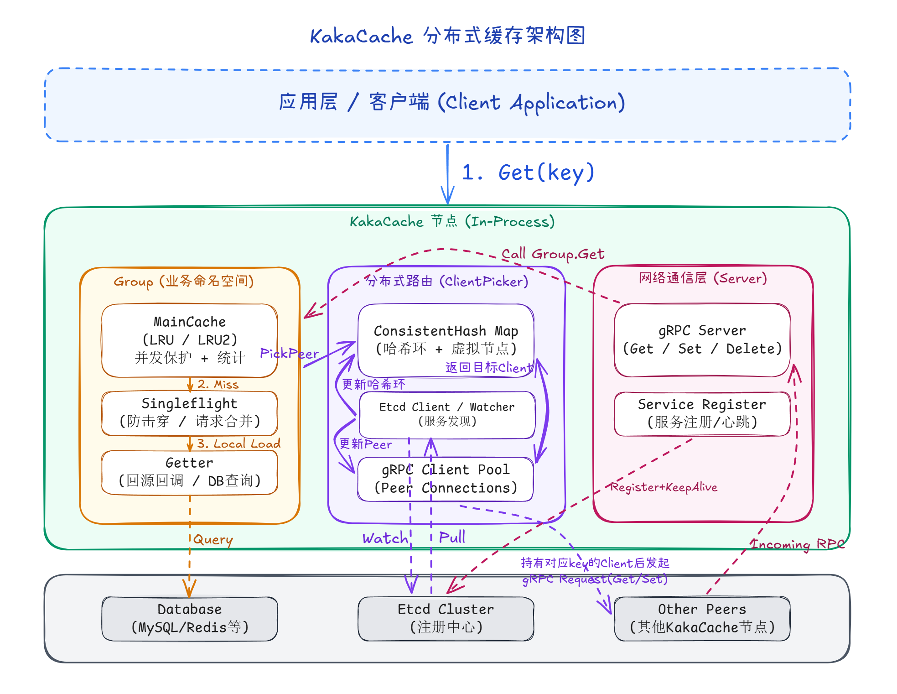
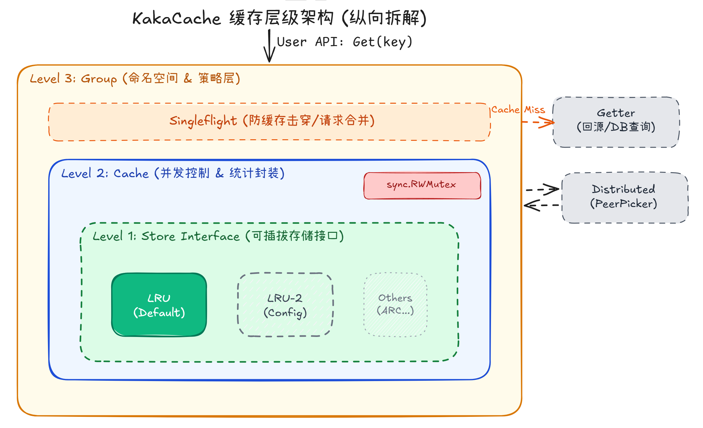

# KakaCache

**KakaCache** 是一个基于 Go 语言实现的分布式内存缓存系统。它参考了 `groupcache` 的设计理念，支持多节点分布式部署、一致性哈希路由、防止缓存击穿（Singleflight）以及可插拔的底层存储策略。

本项目旨在构建一个高可用、高性能且易于扩展的分布式缓存解决方案，适用于高并发场景下的数据加速访问。

---

## 核心特性

- **分布式架构 (Distributed)**: 支持多节点集群部署，利用**一致性哈希 (Consistent Hashing)** 算法实现数据的自动分片与负载均衡。
- **防止缓存击穿 (Singleflight)**: 内置 `singleflight` 机制，确保对同一个 Key 的并发请求在同一时刻只会被执行一次（无论是回源还是远程获取），有效防止缓存击穿。
- **服务发现 (Service Discovery)**: 集成 **Etcd** 进行节点的自动注册与发现，支持节点的动态上下线。
- **高性能通信 (gRPC)**: 节点间采用 **gRPC** 进行高效的 P2P 通信，通过 Protobuf 序列化数据。
- **可插拔存储 (Pluggable Storage)**: 底层存储层抽象为接口，支持 **LRU (Least Recently Used)**、**LRU-K** 等多种淘汰策略，可根据业务需求灵活替换。
- **多级缓存 (Multi-Level Caching)**: 支持本地缓存 + 远程节点缓存 + 回源（Database/File）的三级访问策略。

---

## 系统架构

### 1. 分布式交互架构

KakaCache 采用对等（P2P）架构，每个节点既是客户端也是服务器。



*   **Group**: 业务逻辑的核心容器，管理命名空间。
*   **ClientPicker**: 负责分布式路由。它持有 `ConsistentHash` 环和 `Etcd Client`，决定一个 Key 应该由哪个节点处理。
*   **Server**: 网络通信层，基于 gRPC 接收来自其他节点的请求。
*   **Etcd Cluster**: 作为注册中心，维护集群节点的健康状态。

### 2. 缓存层级架构 (纵向拆解)

在单节点内部，KakaCache 采用了清晰的分层设计，确保并发控制与策略分离。



*   **Level 3 - Group**: 最上层的业务封装，负责协调 `Singleflight`、本地缓存查找和远程节点调用。
*   **Level 2 - Cache**: 并发控制层。通过 `sync.RWMutex` 保护底层存储，并负责统计命中率等指标。
*   **Level 1 - Store Interface**: 抽象存储接口。定义了 `Get`、`Set`、`Delete` 等标准操作，解耦了具体的缓存算法。
*   **Level 0 - Implementations**: 具体的算法实现，如默认的 `LRU` 或进阶的 `LRU-2`。

---

## 项目结构

```text
KakaCache/
├── consistenthash/  # 一致性哈希算法实现
├── singleflight/    # 请求合并机制，防止缓存击穿
├── registry/        # Etcd 服务注册与发现封装
├── store/           # 底层存储接口与实现 (LRU, LRU2等)
├── pb/              # Protobuf 定义与 gRPC 生成代码
├── example/         # 示例代码与集成测试
├── assets/          # 架构图与资源文件
├── cache.go         # 缓存并发控制层
├── group.go         # 核心逻辑：Group 命名空间管理
├── peers.go         # 节点选择与客户端抽象
├── server.go        # gRPC 服务端实现
├── client.go        # gRPC 客户端实现
└── byteview.go      # 缓存值的不可变视图
```

---

## 快速开始

### 环境要求
- Go 1.19+
- Etcd (用于服务发现)

### 运行示例

本项目包含一个完整的集群测试示例 `example/advanced.go`。

1.  **启动 Etcd** (确保本地 2379 端口可用):
    ```bash
    etcd
    ```

2.  **运行集群测试**:
    该示例会启动 3 个节点 (localhost:9001, 9002, 9003)，模拟 API 请求并验证分布式缓存能力。
    ```bash
    go run example/advanced.go
    ```

### 使用代码示例

```go
package main

import (
    "log"
    "net/http"
    "github.com/Nahiyi/KakaCache"
)

func main() {
    // 定义从数据库加载数据的回调函数
    dbGetter := kakacache.GetterFunc(func(key string) ([]byte, error) {
        log.Printf("[DB] searching key: %s", key)
        return []byte("value-from-db-" + key), nil
    })

    // 创建一个缓存组 "scores"
    // 限制最大缓存大小为 8MB
    group := kakacache.NewGroup("scores", 8*1024*1024, dbGetter)

    // 启动 HTTP 服务 (模拟业务入口)
    http.HandleFunc("/api", func(w http.ResponseWriter, r *http.Request) {
        key := r.URL.Query().Get("key")
        
        // 获取缓存数据 (自动处理：本地查找 -> 远程查找 -> 回源加载)
        view, err := group.Get(r.Context(), key)
        if err != nil {
            http.Error(w, err.Error(), http.StatusInternalServerError)
            return
        }
        
        w.Write(view.ByteSlice())
    })

    // 4. (可选) 启动 gRPC 节点和服务发现...
    // 参见 example/advanced.go 获取完整分布式启动代码
    log.Println("Server is running at :8080")
    log.Fatal(http.ListenAndServe(":8080", nil))
}
```

---

## 参阅

本项目参考了以下优秀的开源项目与教程：
- [groupcache](https://github.com/golang/groupcache): Google 出品的分布式缓存库。
- [KamaCache](https://github.com/youngyangyang04/KamaCache-Go): 程序员卡尔的教学项目。

---

## License

MIT License
